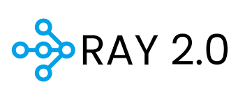
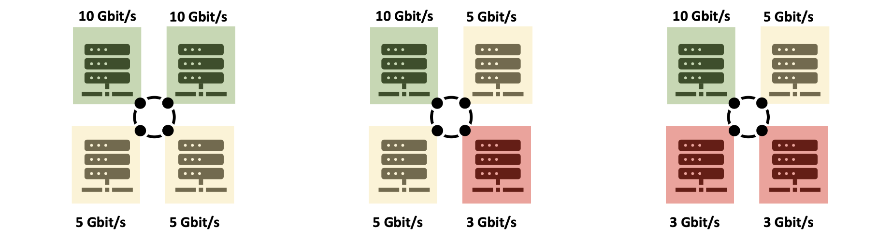
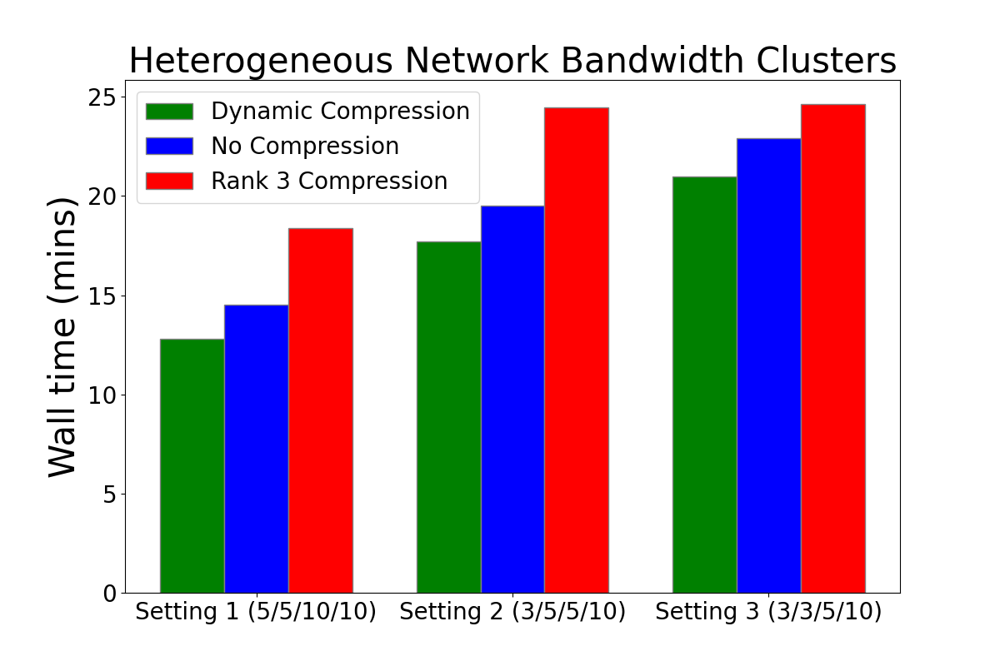
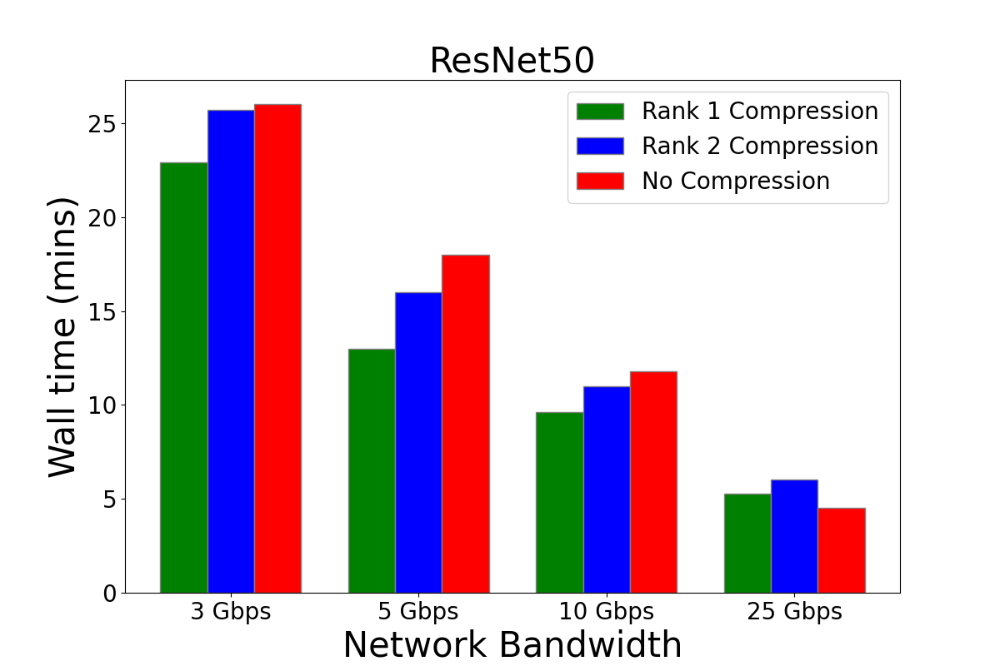
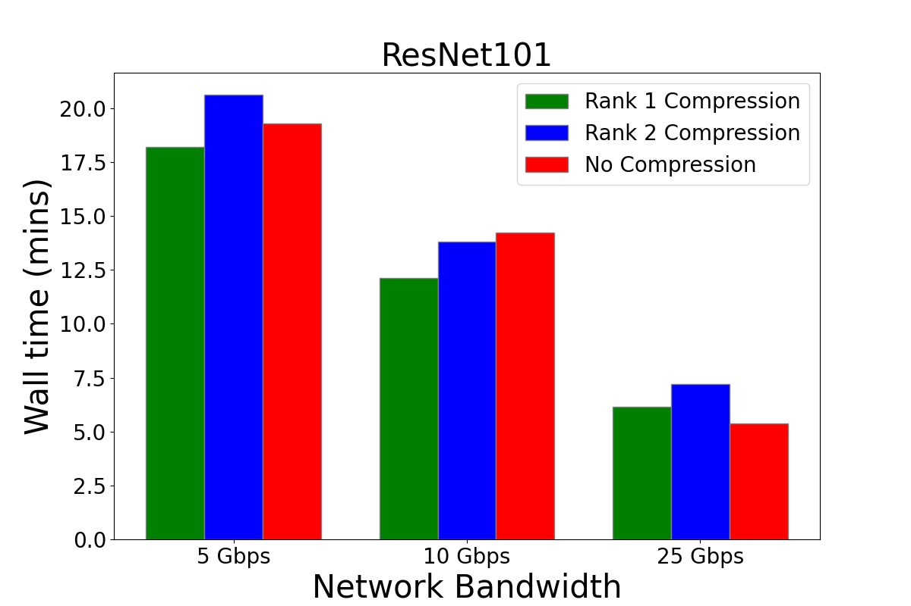

# ray-powerSGD
### Ray-based Network Aware PowerSGD

Aakash Mishra, Matt Fu, Chris Zhu

Contact: aakamishra1@gmail.com, amishra@college.harvard.edu




### Initial Setup for our Ray-based network Aware PowerSGD

1) Setup a Venv/Conda environment
2) Install the latest versions of awscli, boto3, numpy, ray, torch, wandb.
3) Add your AWS credentials via the awscli so you can launch the cluster.

Our implementation requires the version of Ray == 2.1.0

### Configure your raypowersgd/cluster.yml
Assuming you want to use 4 nodes, raypowersgd/cluster.yml is mostly defaulted to work with your account. However, be sure to set your --node-ip-address on line 152 to the new headnode that is generated from doing ray up cluster.yml. 

In order to use the cluster file, you will first have to run:

`aws configure`

This will initialize the credentials that ray uses to create the cluster parameters. 

In order to activate the cluster you will have to run: `ray up cluster.yml`.

Likewise, in order to tear this cluster down you have to use `ray down cluster.yml`.

Note that in our code base the cluster.yml files and corresponding key files are stored in the cluster-configs directory.

### Step by step instructions to launch an experiment.
1) In your terminal, type ray up cluster.yml
2) Copy the line: ray exec <Your cluster.yml path> 'tail -n 100 -f /tmp/ray/session_latest/logs/monitor*
3) In a separate shell, paste it. Once your usage shows 0.0/16.0 CPU (assuming you use our default settings), all nodes have initialized and you can run experiments. 
4) If you want to recreate our experiments exactly, you need to launch each instance in AWS and network bandwidth limit each instance. Use the Linux tc command or the ip link command (should be automically installed for you by us) to limit the bandwidth. 
5) In your original terminal, type ray attach cluster.yml

When the terminal launches, it will open an instance into the head of the newly created ray cluster. From that point you can switch into the deployment directory.

`cd /deployment-scripts`

Then you can run the following depending on the experiment of your choice.

## Baseline Test - Default

```python
python baseline_deployment.py -n 4
```

## Regular PowerSGD Test - Default

```python
python powersgd_deployment.py -n 4
```

## Dynamic Network Aware PowerSGD Test - Default

```python
python dynamic_deployment.py -n 4
```

Each file takes in the number of workers to be used as an argument and whether or not use CUDA and gpu libraries. For hot testing we set this to be false. 


## Mix-Bandwith Tests




- 5, 5, 10, 10 Gbits/s

- 3, 5, 5, 10 Gbits/s

- 3, 3, 5, 10 Gbits/s

## Homogenous Tests

- 3, 5, 10, 25 Gbits/s

## Supported Models

In our models folder we currently support training for ViT-B, ResNet50, ResNet101 and Bert default.

## Supported Datasets

We support testing support on the Penderson Tree Bank (PTB) set and CIFAR-10 for vision models. 

## Rate Limiting on AWS Instances

For our network setup, we use Wondershaper to set and test bandwdths for instances.

- https://github.com/magnific0/wondershaper

`git clone https://github.com/magnific0/wondershaper.git`

`cd wondershaper`

`./wondershaper -h`

## Set Rate of choice per instance

`./wondershaper -u <rate>`

# Results






